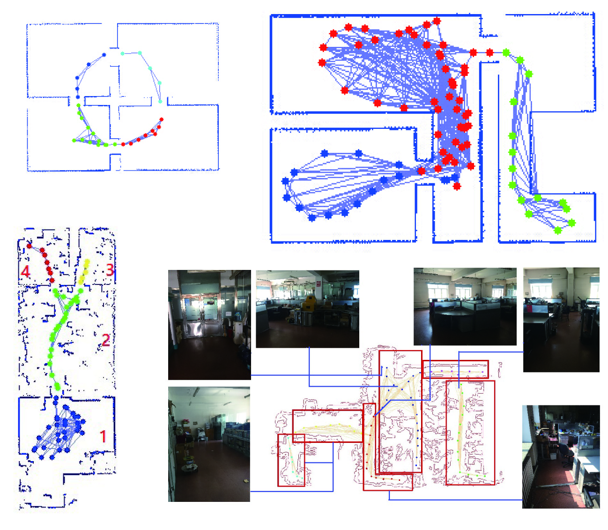
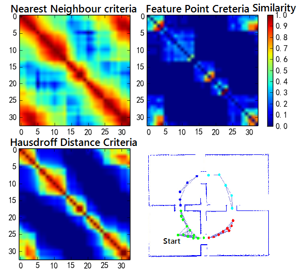

Abstract—Map segmentation method similar to the way
human percept the external environment can decrease the
computational complexity of robot navigation algorithm and
SLAM problem. This paper presents an introduction to the
application of spectral cluster method in map segmentation
process. Then this paper presents several kinds of similarity
measurement criteria to construct the similarity matrix. With
these criteria, mobile robot can encountor different kinds of
environments. Furthermore, this paper presents a self-adaptive
clustering method based on silhouette coefficient criteria. As a
result of that clustering result, an effective online segmentation
method is prepared in this paper. Finally, the results of the
experiment simulated on MobileSim platform demonstrate the
performance of the proposal. The map segmentation method
is which the high cohesion and low coupling are achieved in
information. The segmentation results can greatly reduce the
response time of such NP-Hard problems as large-scale SLAM
and navigation problem.

**Index Terms—Spectral partition, Environment Segmentation,
Mobile Robot, Adaptive Clustering**

## Simulation and Experiment:

## Resource: 

Tian Y, Wang K, Li R and Zhao L (2016) Fast map segmentation
method based on spectral partition for robot semantic
navigation. In: 2016 IEEE International Conference on
Mechatronics and Automation. pp. 1059–1065. DOI:10.1109/
ICMA.2016.7558709.[[pdf]](Resources/Autonomous-Map-Segmentation/PID4286163.pdf) [[ppt]](Resources/Autonomous-Map-Segmentation/document.pdf)